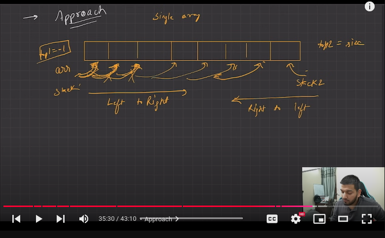

# Stack Implementation  
## two ways two implement stack  
### 1. Array 2.LinkedList  

## we can create Stack using STL   
### Available operation  
#### 1.stack.push(value);   
#### 2.stack.pop(value);
#### 3.stack.peek(value);   
#### 4.stack.empty();  

   ##Approach for two stack in Single array    
first stack is left to right in array  
Second stack is in right most to left in array
